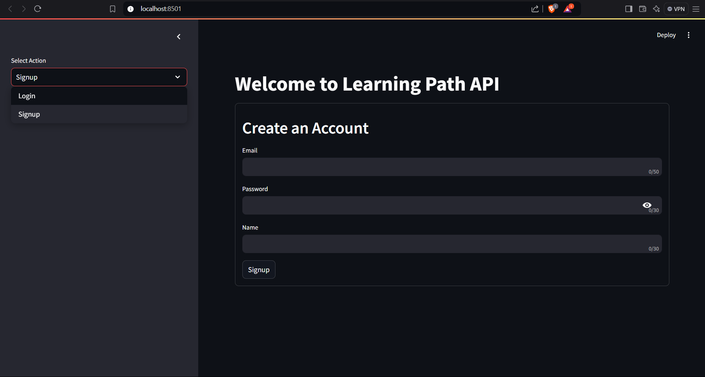
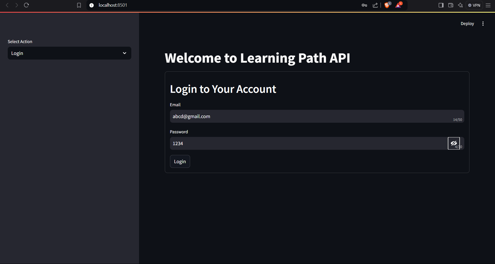
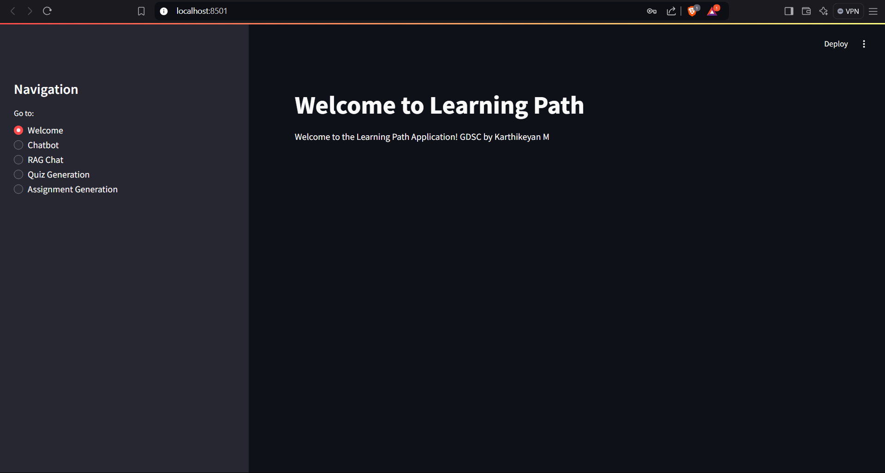
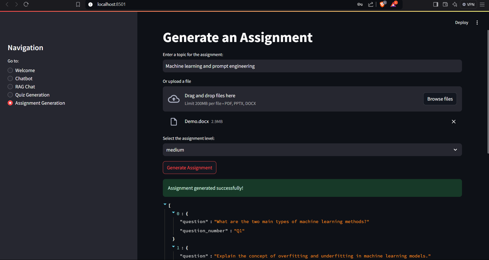
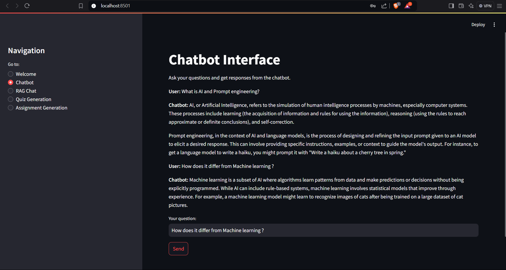
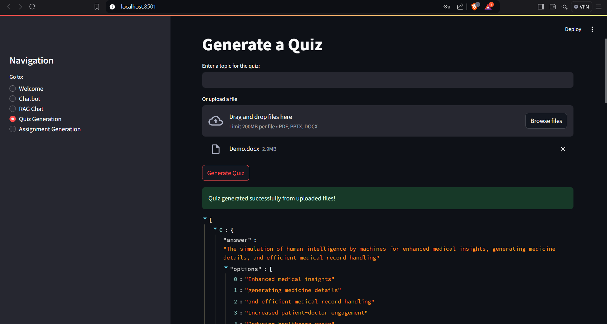
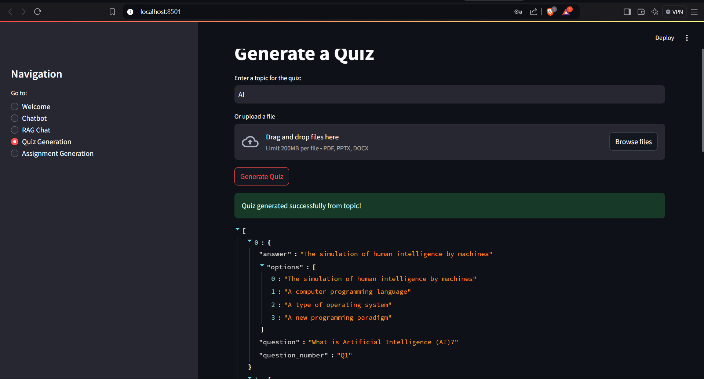
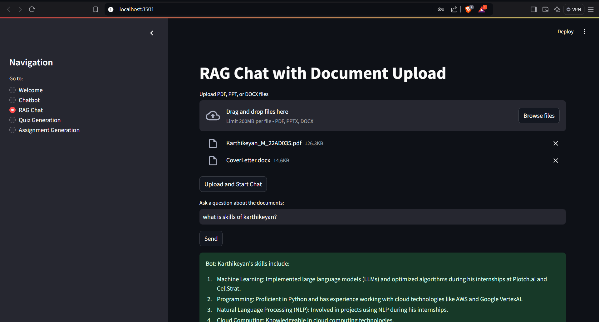

# AI-Powered Chatbot and RAG System

## Table of Contents
- [Introduction](#introduction)
- [Chatbot Feature](#chatbot-feature)
- [RAG Chat](#rag-chat)
- [Quiz Creation](#quiz-creation)
- [Assignment Generation](#assignment-generation)
- [Technologies Utilized](#technologies-utilized)
- [Installation Guide](#installation-guide)

## 🌟 Key Highlights
## Introduction
Welcome to the AI-Powered Chatbot and RAG System! This project harnesses the power of AI models, particularly the Mixtral model from Hugging Face, to provide an intelligent, interactive platform. Users can engage with the system for document analysis, quiz generation, and assignment creation based on input files or topics.

## Chatbot Feature
The Chatbot module enables users to engage in real-time, AI-driven conversations. It's designed to handle a variety of topics, offering accurate and context-aware responses for a more natural user experience.

### Key Features
- **Instantaneous Responses**: Engage with the AI chatbot for real-time answers.
- **Contextual Understanding**: The chatbot retains conversational context, ensuring coherent and relevant responses.

## RAG Chat
The RAG (Retrieval-Augmented Generation) Chat feature allows users to upload documents in multiple formats (PDF, PPT, DOCX) for intelligent content retrieval. The system merges document retrieval with AI-generated responses for a deeper, more informed interaction.

### Key Features
- **Multi-file Uploads**: Seamlessly upload multiple documents for analysis.
- **Informed Responses**: The chatbot uses the content of uploaded documents to generate precise answers.

## Quiz Creation
The system also offers a Quiz Generation feature, where quizzes are dynamically created based on the content of uploaded documents or user-specified topics.

### Key Features
- **Dynamic Quizzes**: Create quizzes on-the-fly based on document contents.
- **Variety of Question Types**: Generate multiple-choice, true/false, and open-ended questions.

## Assignment Generation
This feature provides tailored assignment creation based on uploaded files or selected topics. It’s particularly useful for educators who wish to design topic-specific assignments for their students.

### Key Features
- **Topic-specific Assignments**: Automatically generate assignments based on chosen topics.
- **Content-based Generation**: Assignments are dynamically created using the content from uploaded files.

## Technologies Utilized
The system is built using a variety of cutting-edge technologies to ensure a seamless and scalable solution:

- **Flask**: Lightweight Python web framework for backend development.
- **SQLAlchemy**: ORM tool for database interactions in Python.
- **Blueprints**: Used in Flask for a modular and clean backend architecture.
- **Streamlit**: Framework for building a highly interactive front-end.
- **Hugging Face Models**: Leveraging state-of-the-art NLP models for chatbot responses and document analysis.

## Installation Guide
Follow the steps below to install and run the project:

1. Clone the repository:
   ```bash
   git clone https://github.com/ArunKumar200510/GDG.git
   ```

2. Navigate to the Streamlit app directory:
   ```bash
   cd Learning_Module/streamlit_app
   ```

3. Run the Streamlit app:
   ```bash
   streamlit run app.py
   ```

4. Navigate to the backend directory:
   ```bash
   cd backend
   ```

5. Start the backend server:
   ```python
   python main.py
   ```

6. Don't forget to replace `YOUR_HUGGINGFACE_API` with your actual Hugging Face API key in the backend files.

### 🖥️ User Interface
<p align="center">
  
  
  
  
  
  
  
  
</p>

### Additional Notes
- **Technologies Section**: This section highlights the major technologies utilized, including Flask, SQLAlchemy, and Hugging Face models.
- **Installation Steps**: Simplified and clarified the installation instructions for both frontend and backend setup.

Feel free to modify any section to better fit your project’s specific needs!

## Contact
For any questions or feedback, please reach out:
- **Email**: arun700101@gmail.com
